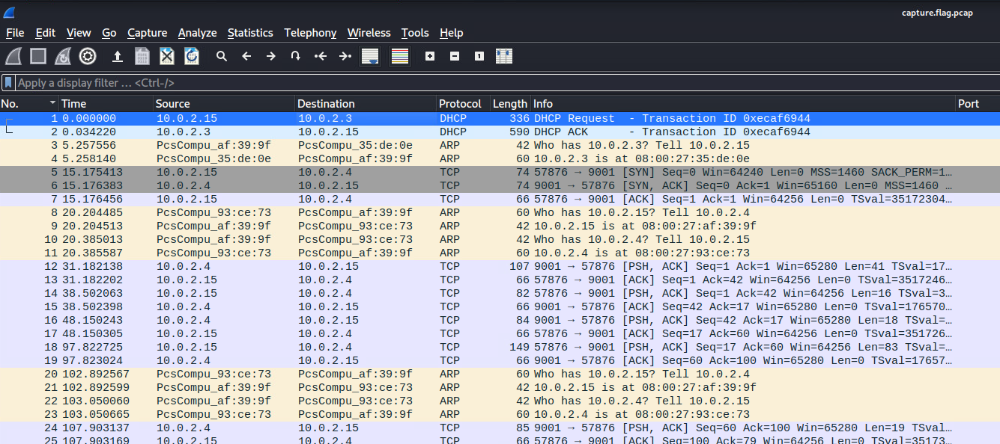
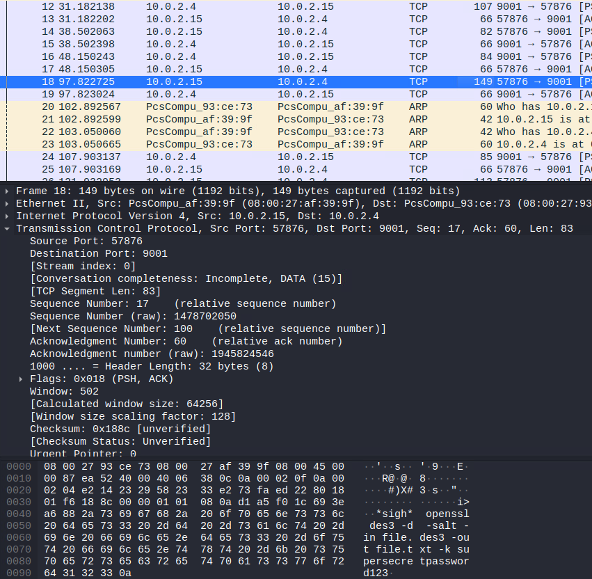
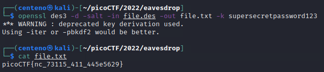

# Eavesdrop
For this challenge we are given a pcap file to analyze and retrieve the flag from.</br>
We can open the file using wireshark.</br>


We see there is a converation occuring between 10.0.2.4 and 10.0.2.15.</br>


Going to packet 18, we also see the following command being sent as text from one disgruntled user to another.</br>

```
openssl des3 -d -salt -in file.des3 -out file.txt -k supersecretpassword123
```

This command encrypts a file, file.des3 using a password "supersecretpassword123" (with salt).</br>
Since we know the password, all we need is file.des3.</br>
Luckily, in packet 57, the file is sent. We can tell by the "Salted" string.</br>


By right-clicking on layer 5, "Data", we can export the packet's bytes and save it as file.des</br>


We can use the command that was sent to decrypt the file to file.txt and cat out the flag!</br>

