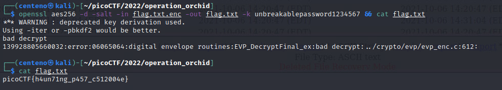

# Operation Orchid
For this challenge we are given a disk image file named disk.flag.img.</br>
We can load the file in autopsy with default values.


Volume 4, aptly named /3/, is the root partition.


The root directory has 3 listings, .ash_history, flag.txt.enc, and a deleted flag.txt.


Opening .ash_history shows previous commands entered.</br>

```
Contents Of File: /3/root/.ash_history
touch flag.txt
nano flag.txt
apk get nano
apk --help
apk add nano
nano flag.txt
open ssl
openssl aes256 -salt -in flag.txt -out flag.txt.enc -k unbreakablepassword1234567
shred -u flag.txt
ls -al
halt
```

Even though flag.txt was shredded, we have the password to open flag.txt.enc.</br>
We can use openssl to decrypt the file using the password and cat out the flag!


