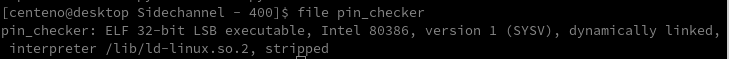
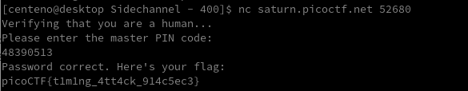

# Sidechannel
In computer security, a side-channel attack is any attack based on information gained from the implementation of a computer system, rather than weaknesses in the implemented algorithm itself (e.g. cryptanalysis and software bugs). Timing information, power consumption, electromagnetic leaks or even sound can provide an extra source of information, which can be exploited. - Wikipedia

For this challenge, we are given a file named pin_checker. Running the file command shows us it is an ELF executable.



A pin is asked when executing the file. Using the time command, we can validate that a timing attack is possible.


As seen, the program closed ~.12 seconds after submitting input '11111111' and '22222222' as the pin, however it took twice as long when submitting '44444444'.</br>

The program appears to be checking one character of the string at a time. If the first number matches, it checks the second, then the third, etc. If a number does not match, the program will not check the rest of the string and instead close after printing 'Access Denied'. This leads to a timing attack as a pin check with more correct numbers will take longer to process.</br>

The following script submits 8-digit pins to the program and checks the amount of time for the program to close. Starting with the first digit, the script processes 10 combinations and places the digit which took the longest to process in the pin list, replacing leading 0s, eventually cracking the pin.

```
#!/usr/bin/env python3

from time import *
from subprocess import *

pin = list("00000000")
t = []

for i in range(len(pin)):
	for j in range(10):
		pin[i]=str(j)
		process = Popen("./pin_checker", shell=True, stdin=PIPE, stdout=PIPE, universal_newlines=True)
		start = time()
		out = process.communicate(input=''.join(pin))[0]
		t.append(time()-start)
	pin[i] = str(t.index(max(t)))
	t = []
	print(''.join(pin))
```


Submitting the code yields us the flag!


