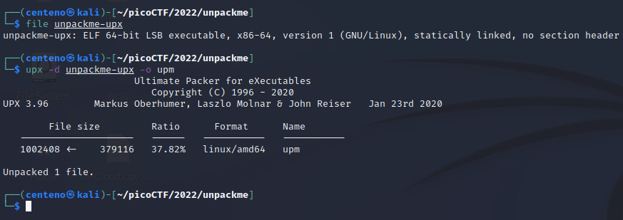
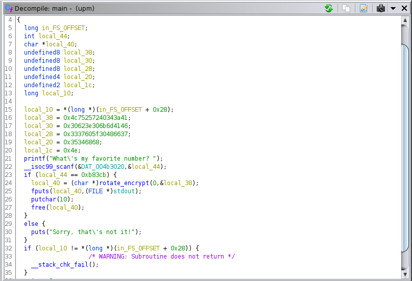
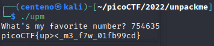

# unpackme

For this challenge, we are given a single file named unpackme-upx. We can unpack it using upx.

We can now open the file using ghidra and look at the main function. 

The main function appears to be a simple if/else statement. If the input's value is 0xb83cb, we will receive the flag. 
Inputting the decimal equivalent, 745635, gives us the flag. 

